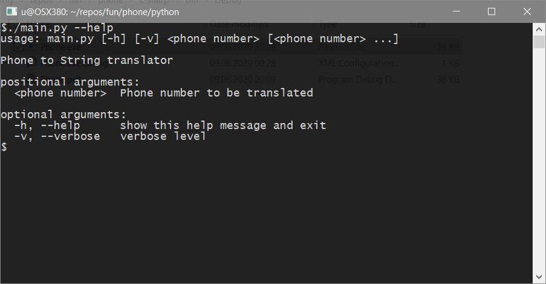
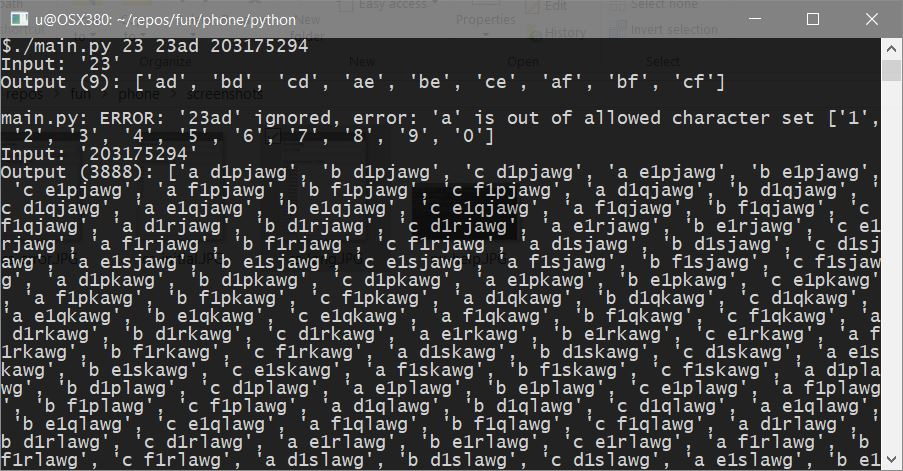
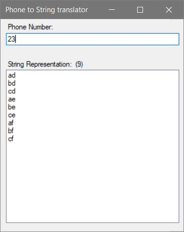
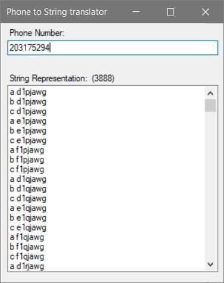
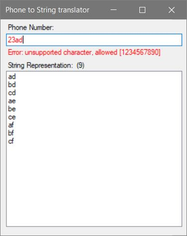

# Letter Combinations of a Phone Number

Given a string containing digits from 2-9 inclusive, return all possible letter combinations that the number could represent.

A mapping of digit to letters (just like on the telephone buttons) is given below.

> **Note:** 1 does not map to any letters.

| 1       |  2 abc    |  3 def  |
| --------|-----------|---------|
| 4 ghi   |  5 jkl    |  6 mno  |
| 7 pqrs  |  8 tuv    |  9 wxyz |
| \* \+   |  0 _      |  ^ #    |

## Example:

```
Input: "23"
Output: ["ad", "ae", "af", "bd", "be", "bf", "cd", "ce", "cf"].
```

> **Note:**
>
> Although the above answer is in lexicographical order, your answer could be in any order you want.

## Solution
### Python

#### Realization
Algorithm [main.py::handle_phone](./python/main.py)

#### Help


#### Usage
Single call handle 3 inputs.
Second one generates an error.



### C#

#### Realization
Algorithm [CPhone2Str.cs::Phone::Translate](./c-sharp/CPhone2Str.cs)

#### On startup


#### Using custom value


#### On error
