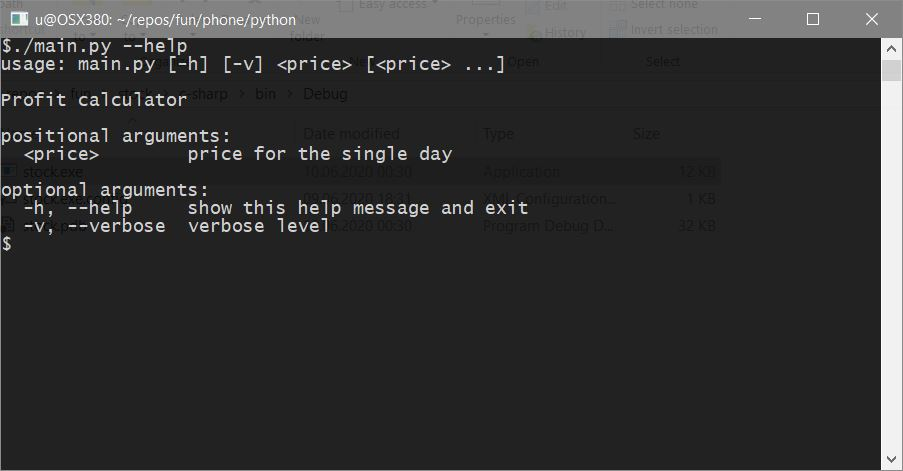
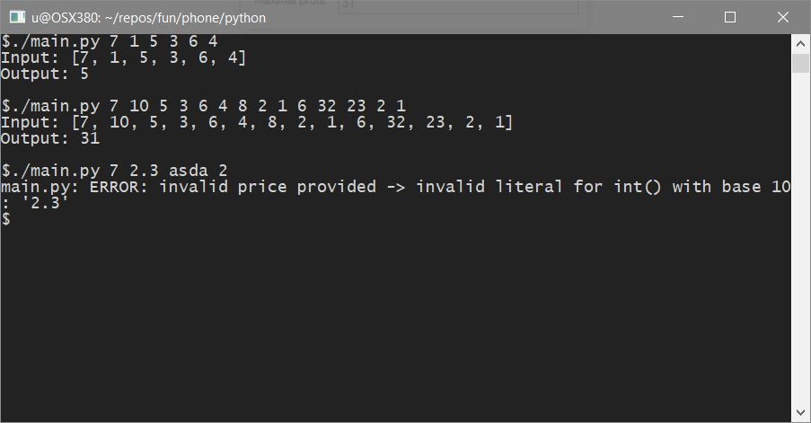
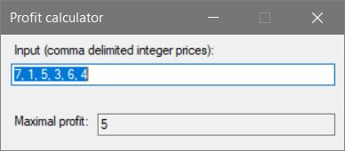
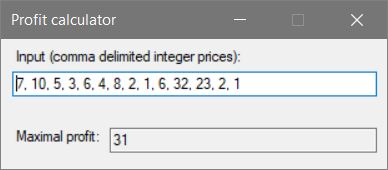
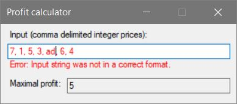

# Best Time to Buy and Sell Stock

Say you have an array for which the ith element is the price of a given stock on day `i`.

If you were only permitted to complete at most one transaction (i.e., buy one and sell one share of the stock), design an algorithm to find the maximum profit.

> **Note:** You cannot sell a stock before you buy one.

## Example 1

```
Input: [7,1,5,3,6,4]
Output: 5
```

> **Explanation:**
>
> Buy on day 2 (price = 1) and sell on day 5 (price = 6), profit = 6-1 = 5.
>
> Not 7-1 = 6, as selling price needs to be larger than buying price.

## Example 2

```
Input: [7,6,4,3,1]
Output: 0
```
> **Explanation:**
>
>   In this case, no transaction is done, i.e. max profit = 0.

## Solution
### Python

#### Realization
Algorithm [main.py::find_profit](./python/main.py)

#### Help


#### Usage
3 calls handle inputs.
Third call generates an error.



### C#

#### Realization
Algorithm [CStock.cs::CStock::Profit](./c-sharp/CStock.cs)

#### On startup


#### Using custom value


#### On error

