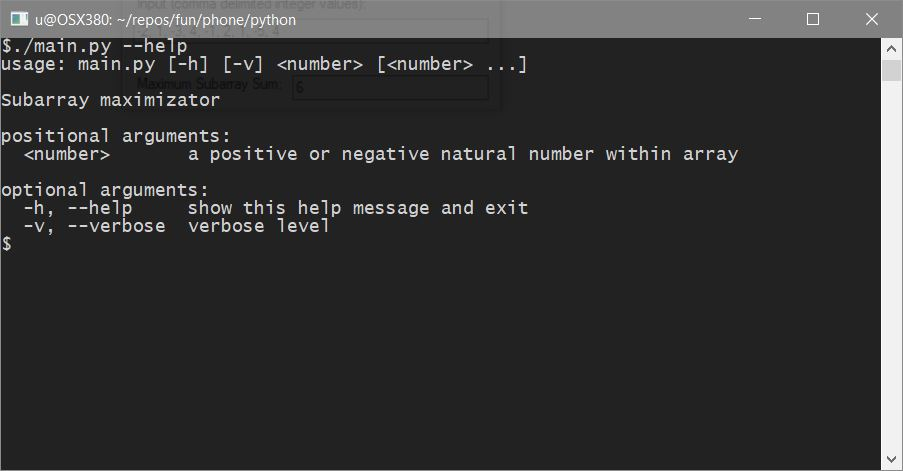
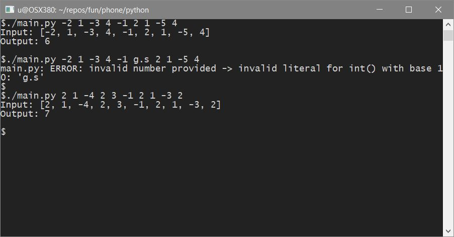
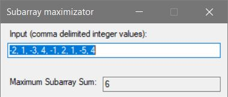
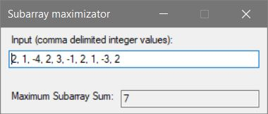
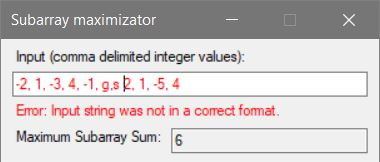

# Maximum Subarray

Given an integer array nums, find the contiguous subarray (containing at least one number) which has the largest sum and return its sum.

## Example:

```
Input: [-2,1,-3,4,-1,2,1,-5,4],
Output: 6
```

> **Explanation:**
>
> [4,-1,2,1] has the largest sum = 6.

## Solution
### Python
#### Help


#### Usage
3 calls handle inputs.
Second call generates an error.



### C#
#### On startup


#### Using custom value


#### On error

