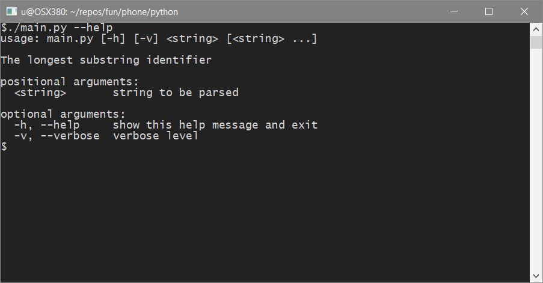

# Longest Substring Without Repeating Characters

Given a string, find the length of the **longest substring** without repeating characters.

## Example 1

```
Input: "abcabcbb"
Output: 3
```

> **Explanation:**
>
> The answer is "abc", with the length of 3.

## Example 2

```
Input: "bbbbb"
Output: 1
```

> **Explanation:**
>
> The answer is "b", with the length of 1.

## Example 3:

```
Input: "pwwkew"
Output: 3
```

> **Explanation:**
>
> The answer is "wke", with the length of 3.
>
> Note that the answer must be a **substring**, "pwke" is a subsequence and not a substring.

## Solution
### Python

#### Realization
Algorithm [main.py::handle_string](./python/main.py)

#### Help


#### Usage
Single call handle 2 inputs.


### C#

#### Realization
Algorithm [CSubStr.cs::CSubStr::MaxSum](./c-sharp/CSubStr.cs)

#### On startup


#### Using custom value

