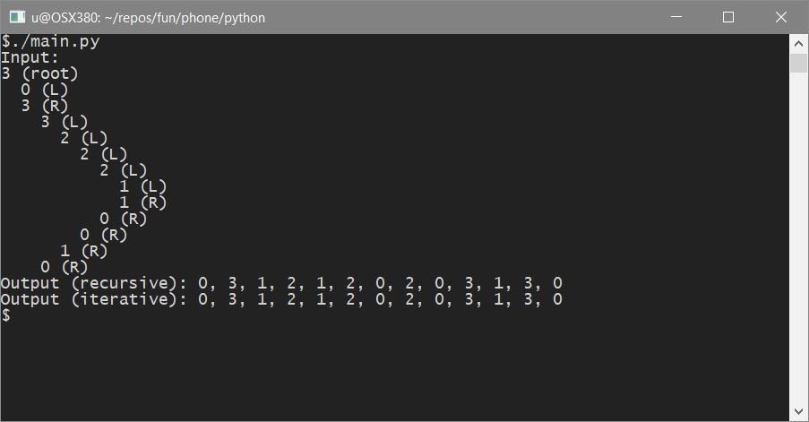
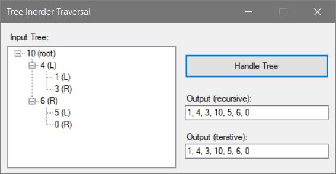

# Binary Tree Inorder Traversal

* Solution 1: recursive
* Solution 2: iterative

```
Input:
       10
    /      \
 4            6
/ \         /   \
1  3       5     0

Output: 1 4 3 10 5 6 0
```

## Solution
### Python

#### Usage
Each run generates a random tree.



### C#
#### Usage
Tree hardcoded within program.



